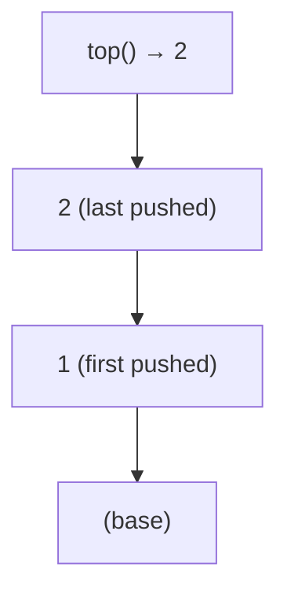
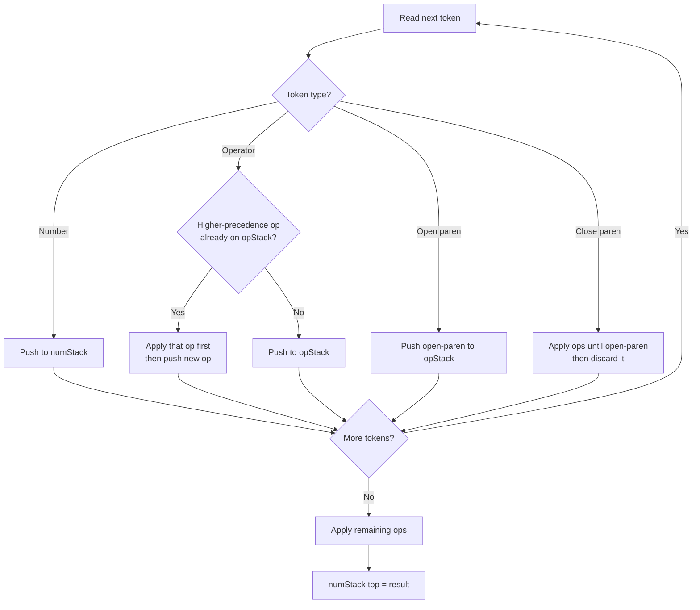
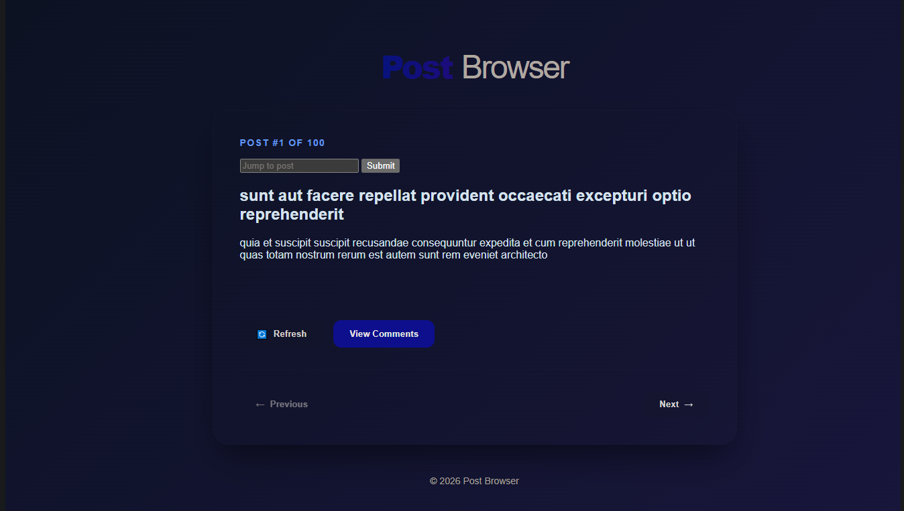
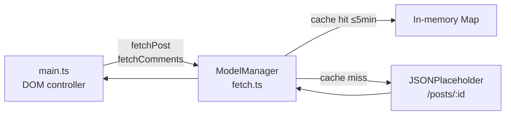

# cc-7-deric

> A hands-on TypeScript curriculum repo documenting the journey through data structures, algorithms, functional programming, async patterns, and a full Vite web app — built during the **CodeCraft** programme.

[](https://github.com/dericjojo-codecraft/cc-7-deric/actions/workflows/ci.yaml)


---

## 📑 Table of Contents

- [Overview](#-overview)
- [Assignment Breakdown](#-assignment-breakdown)
- [Data Structures](#-data-structures)
- [Dijkstra's Two-Stack Evaluator](#-dijkstras-two-stack-evaluator)
- [Post Browser App](#-post-browser-app)
- [Getting Started](#-getting-started)
- [Running Tests](#-running-tests)
- [Tech Stack](#-tech-stack)

---

## 🗺 Overview

This repo tracks a structured progression across three assignments:

| Assignment | Focus | Key Concepts |
|---|---|---|
| `assignment-1` | Foundations + Data Structures | Arrays, strings, LinkedList, Stack, expression evaluation |
| `assignment-2` | Functional Programming | `map`, `filter`, `reduce`, HOFs, closures, predicates |
| `assignment-3` | Async & DOM | Promises, `async/await`, fs API, fetch, Vite web app |

---

## 📂 Assignment Breakdown

<details>
<summary><strong>Assignment 1 — Foundations & Data Structures</strong></summary>

### Initial Problems
A set of warm-up exercises covering core TypeScript patterns:

- **`oddOrEven.ts`** — generate n odd or even numbers
- **`decimalToBinary.ts`** — decimal → binary string conversion
- **`dayOfWeek.ts`** — map 3-char day names to index 0–6
- **`nonRepeatSubs.ts`** — first non-repeating character substring
- **`paddingZeroes.ts`** — zero-pad numbers to a minimum digit width
- **`addArray.ts`** — element-wise addition with unequal length support
- **`perfectSquares.ts`** — generate first n perfect squares
- **Heart patterns** — triangle generators using `💚` and `💙` emojis

### LinkedList & Stack

Full class-based implementations using private fields (`#head`, `#tail`, `#__items`) with comprehensive Vitest test suites covering construction, mutation, edge cases, and generics.

### Expression Evaluator

Dijkstra's Two-Stack Algorithm — see [dedicated section below](#-dijkstras-two-stack-evaluator).

</details>

<details>
<summary><strong>Assignment 2 — Functional Programming</strong></summary>

Focused on mastering higher-order functions through real-world data manipulation:

| File | What it does |
|---|---|
| `employees.ts` | Salary totals, full names, email strings via `reduce` |
| `quotes.ts` | Group by author, case-insensitive search, deduplication |
| `mapFilterUsingReduce.ts` | Custom `map` and `filter` built entirely on `reduce` |
| `predicate.ts` | `some()` implemented both imperatively and functionally |
| `secondLargest.ts` | Second largest with `forEach` and `reduce` |
| `fruits.ts` | Filter + transform multi-line string data |
| `fibo.ts` | Fibonacci values via `map` |
| `hof.ts` | Closure-based cutoff function (higher-order function) |
| `alphabets.ts` | Split alphabet into vowels/consonants with `reduce` |
| `emails.ts` | Regex-based email extraction and normalisation |
| `nutritionOfFood.ts` | Filter, classify, and cross-reference food ingredients |

</details>

<details>
<summary><strong>Assignment 3 — Async, Promises & Web App</strong></summary>

### Promise & async/await patterns

Three progressive implementations of the same file-system API:

| File | Style |
|---|---|
| `filesBasedPromises.ts` | Callback-based `fs` wrapped in Promises |
| `filesBasedPromises2.ts` | Promise chaining with `.then()` |
| `asyncAwait.ts` | Clean `async/await` style |

All three implement `getFileType`, `getContents`, and `getSize` — fully tested in `asyncTest.test.ts` using a temp directory created with `beforeAll`.

### Fetch & Users

`users.ts` — `getUsers()` fetches from JSONPlaceholder with a configurable delay, mock-tested with `vi.stubGlobal`.

### Post Browser (Vite App)

See [Post Browser App section](#-post-browser-app) below.

</details>

---

## 🛠 Data Structures

### LinkedList

```ts
const list = new LinkedList<number>();
list.addAtEnd(10);
list.addAtHead(5);
list.valueAtHead();               // 5
list.valueAtTail();               // 10
list.searchFor(10, (a, b) => a === b); // 1
list.length();                    // 2
list.removeFromHead();            // 5
```


| Method | Description | Complexity |
|---|---|---|
| `addAtHead(t)` | Prepend a node | O(1) |
| `addAtEnd(t)` | Append a node | O(1) |
| `removeFromHead()` | Remove & return head value | O(1) |
| `removeFromEnd()` | Remove & return tail value | O(n) |
| `searchFor(t, fn)` | Find index by comparator | O(n) |
| `valueAtIndex(i)` | Get value at position | O(n) |
| `length()` | Count all nodes | O(n) |

### Stack

Built on top of `LinkedList` using a private field `#__items`:

```ts
const stack = new Stack<number>();
stack.push(1);
stack.push(2);
stack.top();  // 2  ← peek without removing
stack.pop();  // 2
stack.top();  // 1
```



| Method | Description | Complexity |
|---|---|---|
| `push(item)` | Add to top | O(1) |
| `pop()` | Remove & return top | O(1) |
| `top()` | Peek at top without removing | O(1) |

---

## 🧮 Dijkstra's Two-Stack Evaluator

Evaluates arithmetic expressions respecting operator precedence and parentheses — using two stacks internally.

### Algorithm flow



### Worked example

```
Expression:  5 * ( 6 + 2 ) - 12 / 4

numStack   opStack   Action
─────────────────────────────────────
[5]        [*]       read 5, then *
[5]        [*, (]    read (
[5,6]      [*, (, +] read 6, then +
[5,6,2]    [*, (, +] read 2
[5,8]      [*]       ) triggers: 6+2=8, pop (
[40]       [-]       * applied: 5*8=40, then read -
[40,12]    [-, /]    read 12, then / (higher prec than -)
[40,3]     [-]       / applied: 12/4=3
[37]       []        end: - applied: 40-3=37

Result: 37 ✓
```

### Usage

```ts
evaluateExpression("2 + 3")                    // 5
evaluateExpression("( 2 + 3 ) * 4")            // 20
evaluateExpression("5 * ( 6 + 2 ) - 12 / 4")  // 37
evaluateExpression("a * 3")                    // undefined — invalid token
evaluateExpression("5 +")                      // undefined — malformed
evaluateExpression("")                         // undefined — empty string
```

---

## 🌐 Post Browser App

A Vite + TypeScript single-page app that browses posts from the [JSONPlaceholder API](https://jsonplaceholder.typicode.com/posts).

**Live demo:** [post-browser-nine.vercel.app](https://post-browser-nine.vercel.app)


### Features

- Browse all 100 posts with **Previous / Next** navigation
- **Jump to any post** by number with input validation (1–100)
- **View Comments** for the current post on demand
- **Refresh** clears the cache and forces a live re-fetch
- **5-minute TTL cache** via `ModelManager` — avoids redundant API hits

### Architecture



### Run locally

```bash
cd assignment-3/post-browser-vite
npm install
npm run dev      # dev server
npm run build    # production build
npm run preview  # preview production build
```

---

## 🚦 Getting Started

**Prerequisites:** Node.js ≥ 20, TypeScript

```bash
git clone https://github.com/dericjojo-codecraft/cc-7-deric.git
cd cc-7-deric
npm install
```

Run any assignment file directly:

```bash
node assignment-1/initialProblems/oddOrEven.ts
node assignment-2/employees.ts
node assignment-3/users.ts
```

---

## 🧪 Running Tests

```bash
# Watch mode (default)
npm test

# Single run with coverage
npm run test:coverage

# Lint only
npm run lint
```

Tests are written with **Vitest** and cover all major modules including LinkedList, Stack, the expression evaluator, async file utilities, employee/quotes data transforms, and the fetch mock. The CI pipeline (GitHub Actions on Node 20) runs lint + tests on every push and PR to `main`.

---

## 🧰 Tech Stack

| Tool | Version | Role |
|---|---|---|
| TypeScript | 5.9 | Primary language |
| Vitest | 4.x | Unit testing framework |
| ESLint + typescript-eslint | 10.x / 8.x | Linting & type-aware rules |
| node | 10.x | Run `.ts` files |
| Vite | 8.x | Post Browser bundler & dev server |
| Node.js | ≥ 20 | Runtime |
